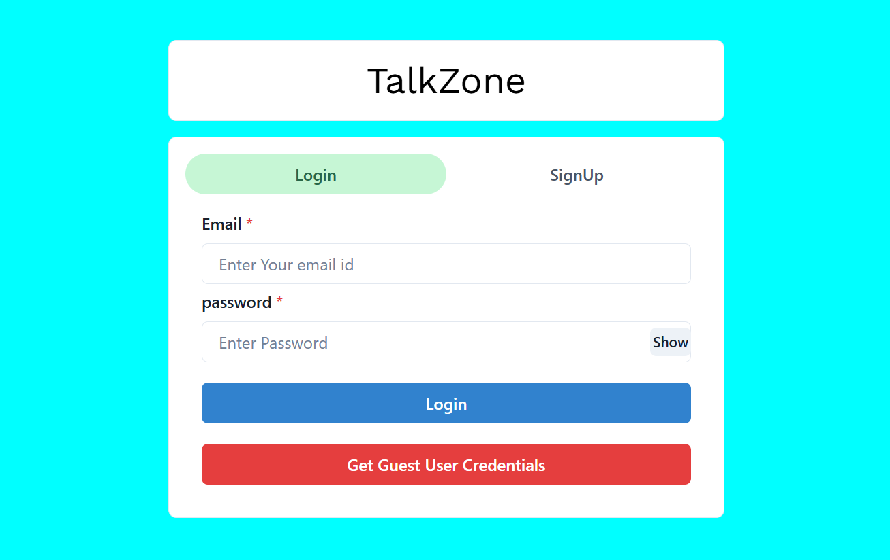
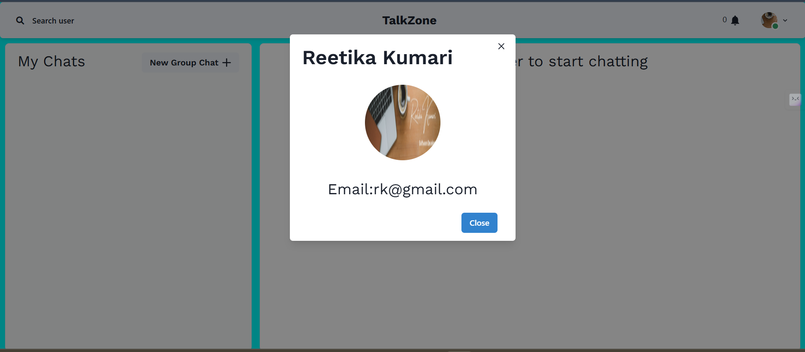
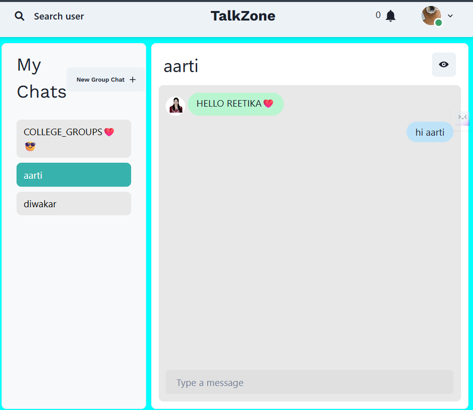
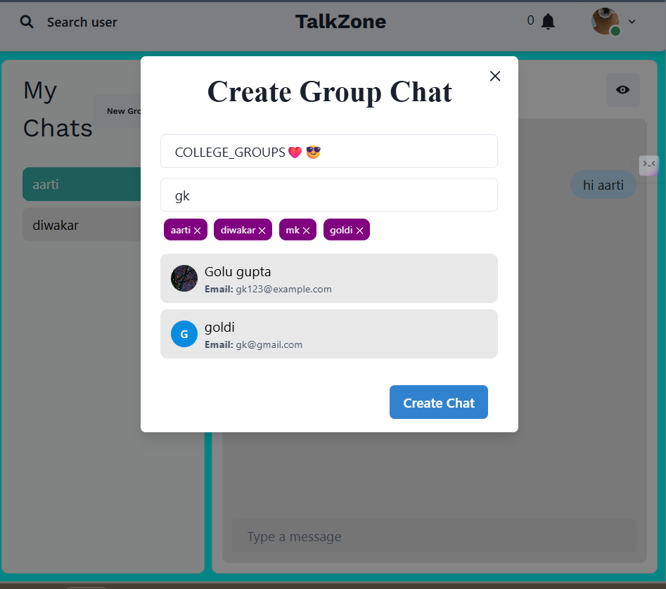
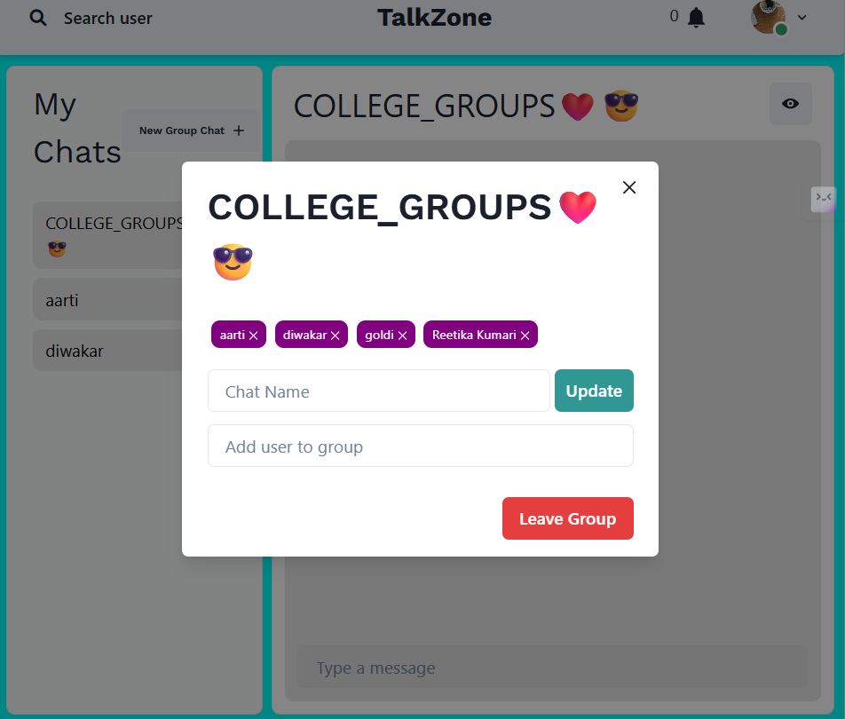
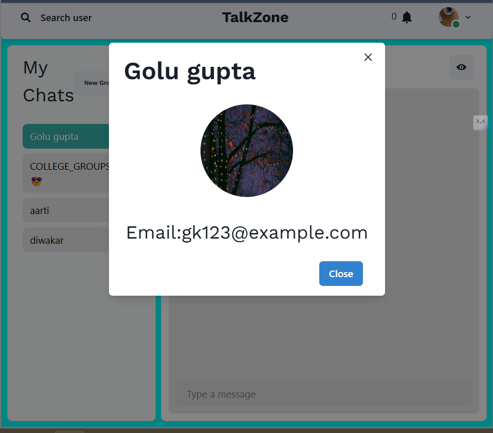

# Talk Zone

A real-time group chat application that enables users to create and manage chat groups, exchange messages instantly, and maintain secure communication.

## 🚀 Features

- **User Authentication**: Secure registration and sign-in functionality.
- **Group Management**: Create, delete, and manage chat groups.
- **Real-time Messaging**: Instant messaging within groups using WebSockets.
- **User Permissions**: Role-based access control for group members.
- **Data Security**: Ensured privacy and protection of user data.

## 🛠 Tech Stack

- **Frontend**: React.js
- **Backend**: Node.js, Express.js
- **Database**: MongoDB
- **Real-time Communication**: WebSockets

## 🛠 Installation Guide

1. **Clone the repository**
   ```bash
   git clone https://github.com/your-username/talkzone.git
   cd talkzone
   ```
2. **Install dependencies**
   ```bash
   npm install
   ```
3. **Set up environment variables**
   - Create a `.env` file in the root directory and add your MongoDB URI and other necessary credentials.

4. **Run the development server**
   ```bash
   npm run dev
   ```

Demo
https://talkzone-dcbn.onrender.com/

Features
Authenticaton


TalkZone Chat UI


Notifications

Real Time Chatting with Typing indicators

Search Users

One to One chat

Create Group Chats

Add or Remove users from group

View Other user Profile


Made By
@REETIKA KUMARI
