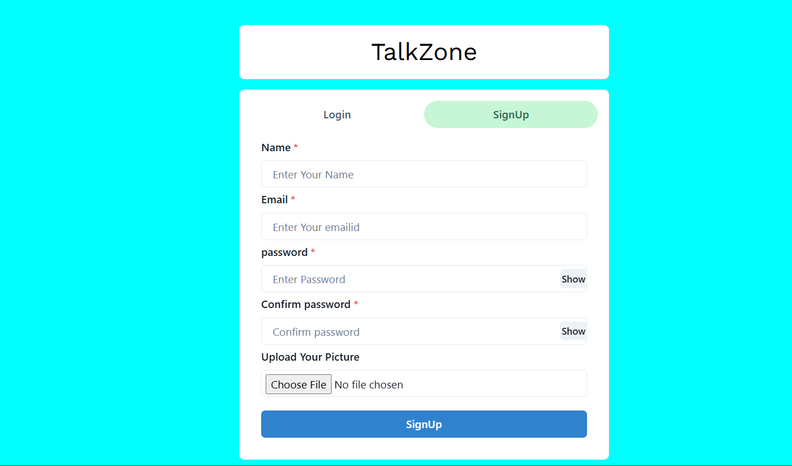
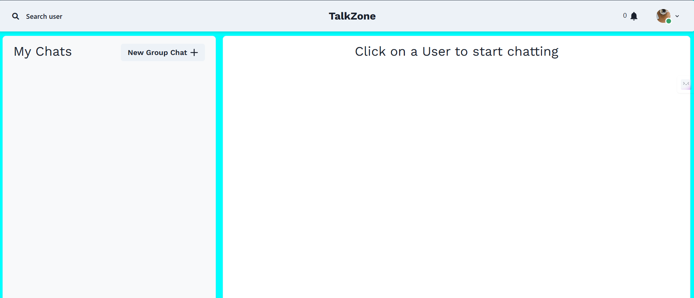
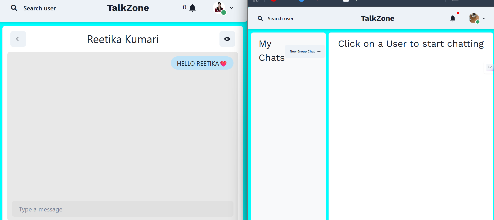
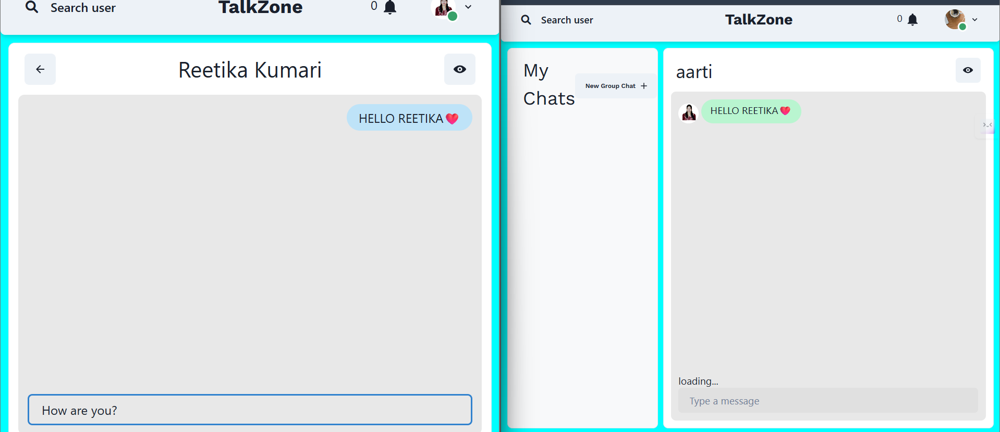
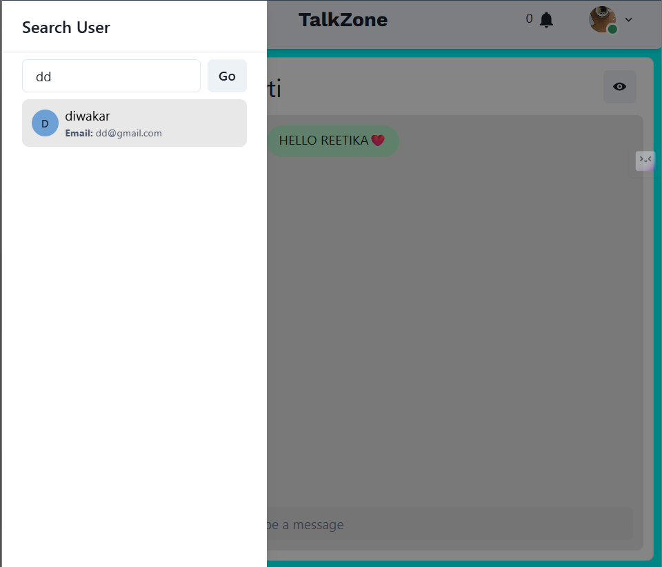

# Talk Zone

A real-time group chat application that enables users to create and manage chat groups, exchange messages instantly, and maintain secure communication.

## 🚀 Features

- **User Authentication**: Secure registration and sign-in functionality.
- **Group Management**: Create, delete, and manage chat groups.
- **Real-time Messaging**: Instant messaging within groups using WebSockets.
- **User Permissions**: Role-based access control for group members.
- **Data Security**: Ensured privacy and protection of user data.

## 🛠 Tech Stack

- **Frontend**: React.js
- **Backend**: Node.js, Express.js
- **Database**: MongoDB
- **Real-time Communication**: WebSockets

## 🛠 Installation Guide

1. **Clone the repository**
   ```bash
   git clone https://github.com/your-username/talkzone.git
   cd talkzone
   ```
2. **Install dependencies**
   ```bash
   npm install
   ```
3. **Set up environment variables**
   - Create a `.env` file in the root directory and add your MongoDB URI and other necessary credentials.

4. **Run the development server**
   ```bash
   npm run dev
   ```

## 🚀 Demo

🔗 https://talkzone-dcbn.onrender.com/

---

## ✨ Features Showcase

### 🔐 Authentication

<p>
  
  
</p>

---

### 💬 Chat Interface

<p>
  
  
</p>

---

### 🔔 Notifications

<p>
  
</p>

---

### ⌨️ Real-Time Chat (Typing Indicator)

<p>
  
</p>

---

### 🔍 Search Users

<p>
  
</p>

---

### 👤 One-to-One Chat

<p>
  
</p>

---

### 👥 Group Chat

<p>
  
  
</p>

---

### 👀 User Profile

<p>
  
</p>

---

## 👩‍💻 Made By

**Reetika Kumari**
